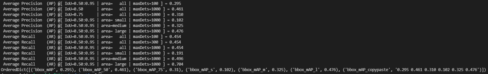
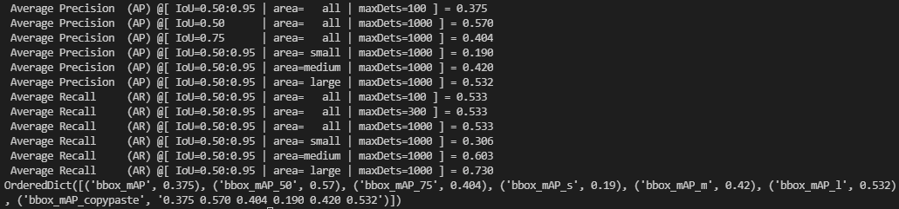

# startup

代码：https://github.com/open-mmlab/mmdetection

知乎入门：https://zhuanlan.zhihu.com/p/101225733

从清华源安装的pytorch和torchvision貌似都是CPU版本……吐了，不能用清华源装。

版本之间的对应关系：https://blog.csdn.net/candice5566/article/details/112570096，https://www.cnblogs.com/tingtin/p/14602192.html，注意全部都要对应！

184上 /data1/yangfan/COCO/ 是COCO2017数据集，创建了到一个软链接到`mmdetection/data/coco`

尝试训练，跑CenterNet：` CUDA_VISIBLE_DEVICES=7 python tools/train.py configs/centernet/centernet_resnet18_dcnv2_140e_coco.py --work-dir ./`，`--show-dir`命令好像用不了，不知道为什么。用`tmux`在后台跑。

- `CUDA_VISIBLE_DEVICES=4,5,6,7 PORT=29501 python -m torch.distributed.launch --nproc_per_node=4 --master_port=29501 tools/train.py ./configs/centernet/centernet_resnet18_dcnv2_140e_coco.py --launcher pytorch --work-dir ../hello_mmdet/ > centernet-train-log.txt `

我尝试进行一些单步方法的测试：

尝试测试，跑CenterNet：`python tools/test.py configs/centernet/centernet_resnet18_dcnv2_140e_coco.py checkpoints/centernet_resnet18_dcnv2_140e_coco_20210520_101209-da388ba2.pth --eval bbox`，结果如下：

- 

尝试测试，跑YOLOF：`python tools/test.py configs/yolof/yolof_r50_c5_8x8_1x_coco.py checkpoints/yolof_r50_c5_8x8_1x_coco_20210425_024427-8e864411.pth --eval bbox`

- 